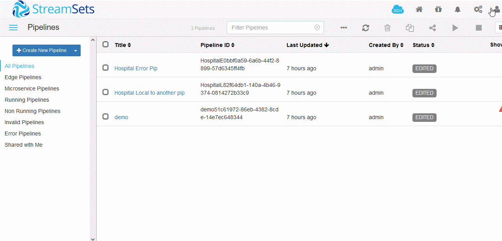

# StreamSets Data Collector
> [StreamSets 官网](https://streamsets.com/) ，当前官网 PaaS 版本需要注册和登录，这两步骤需要科学上网
>
> SDC = StreamSets Data Collector 软件名
>
> CDC = Change Data Capture 变更数据捕获

## SDC 历史
1. 之前，可以直接从 StreamSets 官网下载安装包安装（可以明确 3.15.x 版本时代还是可以直接下载的）
   > 已失效的 [下载链接](https://streamsets.com/products/dataops-platform/data-collector/download/) 以及不存在的页面：
   > 

2. 大概到了 3.19.x 版本开始，安装好了之后需要跳转官网登录之后才可以使用（但是当前官网已经不再支持那个登录跳转的链接）
   > 4.0.x 版本又不再跳转登录，已知 docker 安装的 3.19, 3.20 会跳

3. 大概到了 4.0.x 版本开始引入了 DataOps Platform，大概要开始做 SaaS 平台

4. 大概到了 4.3.x 版本，产品由 Apache License, Version 2.0 变成 2022 StreamSets, Inc 版权所有，

   大概这个版本开始（可能 4.0.x 就已经开始了），产品的使用方式有所改变，用户网页登录创建 Pipeline，在服务器安装 Data Collector Engine 端作为实际 pipeline 运行的环境（如果有使用 GitHub Action 的话有点像私有部署的 GitHub Runner）

> 以上内容基于手工测试以及大量臆测，所以不一定准确，具体查看产品的 [更新日志](https://docs.streamsets.com/portal/datacollector/3.22.x/help/datacollector/UserGuide/WhatsNew/WhatsNew_Title.html#concept_mv5_jys_x4b)

## Docker 方式使用 SDC
### 资源
- [SDC Core 版本 repo](https://hub.docker.com/r/streamsets/datacollector/tags) 如果要离线安装且正常使用的话建议最高 3.18.x 版本，参考上面的 `SDC 历史` 的说明
- [SDC 拓展 Stages repo](https://hub.docker.com/r/streamsets/datacollector-libs/tags)

### 说明
docker 安装的都是 core 版本，带有一定的 stages，可以自己添加额外的 stages lib

**要实现 CDC 功能至少需要添加 JDBC stage-libs**，另还需要自己上传对应数据库的 JDBC 驱动包

### 安装
1. 在 tags 中选中一个版本
2. 在 docker 正常运行的机器执行 `docker run -p 18630:18630 -d streamsets/datacollector:<version-tag>`
3. 访问 `http://<IP>:18630` 打开登录页，默认用户、密码为 admin/admin

其他更多参考 docker hub 的 overview（但该 overview 许久未更新，有选择、审慎地查看）

### 添加 Stage Libs
> 什么是 Stage libs？SDC 中对步骤的定义就是 Stage，例如，如果想通过 CDC 连接 MySQL 就需要使用 `MySQL CDC Clent` 这个 Stage，这个 Stage 会给出一些配置项进行配置，这些内容都在对应的 Stage Libs 里，可以理解为插件包

假设当前选定的 SDC 的版本为 [3.17.1-latest](https://hub.docker.com/r/streamsets/datacollector/tags?page=1&name=3.17.1-latest)

1. 查看对应版本适用的 libs

   将该版本输入到 streamsets/datacollector-libs 仓库的 Tags 检索里面，可以查看到该版本适用的所有的 [stages lib](https://hub.docker.com/r/streamsets/datacollector-libs/tags?page=1&name=3.17.1-latest)
2. 拉取指定的 lib 的镜像

   这里以 [jdbc lib](https://hub.docker.com/r/streamsets/datacollector-libs/tags?page=1&name=streamsets-datacollector-jdbc-lib-3.17.1-latest) 为例

   1. 根据 docker hub 右侧的提示命令拉取镜像 `docker pull streamsets/datacollector-libs:streamsets-datacollector-jdbc-lib-3.17.1-latest`
   2. 查看拉取镜像的属性 `docker inspect streamsets/datacollector-libs:streamsets-datacollector-jdbc-lib-3.17.1-latest` 得以下结果
      > 这里取决于 docker 的版本和 docker 文件系统的选择，所以可能不同，总之目标就是 **拿出该镜像里面的 jar 包**（可以考虑以此镜像启动再到 volume 中获取）
       ``` json
       "GraphDriver": {
           "Data": {
               "MergedDir": "/var/lib/docker/overlay2/3f9928cd15a9400423edbf5fbc42ba080cf3920d31f3deffe8a573306cbad2b9/merged",
               "UpperDir": "/var/lib/docker/overlay2/3f9928cd15a9400423edbf5fbc42ba080cf3920d31f3deffe8a573306cbad2b9/diff",
               "WorkDir": "/var/lib/docker/overlay2/3f9928cd15a9400423edbf5fbc42ba080cf3920d31f3deffe8a573306cbad2b9/work"
           },
           "Name": "overlay2"
       }
       ```
   3. cd 到 UpperDir 里面， 可以看到里面的内容如下 `./opt/streamsets-datacollector-3.17.1/streamsets-libs/streamsets-datacollector-jdbc-lib/lib/*.jar` 这些 jar 就是需要的
3. 将 jdbc 有关的 lib 导入到正在运行的 sdc 容器（保留目录层次）
   > 你的目录大概率与我的不同，而且需要替换容器名和 sdc 版本等操作
   `docker cp /var/lib/docker/overlay2/3f9928cd15a9400423edbf5fbc42ba080cf3920d31f3deffe8a573306cbad2b9/diff/opt/streamsets-datacollector-3.17.1/streamsets-libs/streamsets-datacollector-jdbc-lib/* <sdc 容器名>:/opt/streamsets-datacollector-3.17.1/streamsets-libs/`
4. 重启 sdc 容器使之生效，可以看到包含了 jdbc 的 stages

   

### 上传 JDBC JAR 包（以 MySQL 为例）
> 目的：连接目标库 MySQL 数据库。根据需要连接的 MySQL 来选择具体的 JAR 版本（与 Maven 项目 import 依赖类似）


点击 **upload**，上传成功之后，界面提示需要重启 SDC，点击确认即可重启


查看上传的 JAR 包


## 参考资源
1. [SDC 官方文档](https://docs.streamsets.com/)
2. [SDC Stage 说明（以 3.17.1 为例，查看 Origins, Processors, Destinations, Executors）](https://docs.streamsets.com/portal/datacollector/3.17.x/help/index.html)
3. [StreamSets 中文站](http://streamsets.vip/)

## 类似方案
1. [Apache Nifi](https://nifi.apache.org/)
2. [Apache Camel](https://camel.apache.org/)
3. [Aliyun DataWorks](https://www.aliyun.com/product/bigdata/ide) & 开源版 [dataX](https://github.com/alibaba/datax)
4. [Debezium](https://debezium.io/) + Kafaka
5. [Flink](https://flink.apache.org/)
6. [SeaTunnel](https://seatunnel.apache.org)
