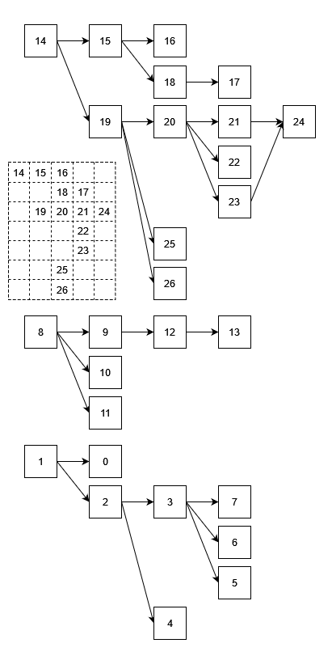

# DAG Layout 有向无环图布局
## 前言
- DAG, Directed Acyclic Graph 有向无环图
- [Graph Layout 图常用布局](https://g6.antv.vision/zh/docs/api/graphLayout/guide)
    
    其中，[Dagre Layout 层次布局](https://g6.antv.vision/zh/docs/api/graphLayout/dagre), [Grid Layout 网格布局](https://g6.antv.vision/zh/docs/api/graphLayout/grid) 有参考价值 
- [TreeGraph Layout 树常用布局](https://g6.antv.vision/zh/docs/api/treeGraphLayout/guide)

    其中，[CompactBox 紧凑树](https://g6.antv.vision/zh/docs/api/treeGraphLayout/compactBox), [Dendrogram 生态树](https://g6.antv.vision/zh/docs/api/treeGraphLayout/dendrogram), [Mindmap 脑图树](https://g6.antv.vision/zh/docs/api/treeGraphLayout/mindmap) 有参考价值

## 应用场景
- 流程图的展示

## 一种简单的基于二维数组定位布局的实现
### 思路
- 节点的位置和线分开处理。着重节点的排列，不考虑线的交叉
- 节点间连线一般由前端通过 `[preNodeId, nextNodeId]` 这样的结构就可以实现，这里不做介绍
- **将节点映射到二维数组中**
    - 从左到右，从上到下
    - 二维数组 row.size = column.size = node.size（极限情况：全都是头节点；没有分支的连续流程）
- 找到头节点（无后续节点），逐个绘制
- 迭代实现，迭代返回后续 **节点块** 所占据的 row 高度
### Pros&Cons
Pros:
- 实现简单

Cons:
- 屏幕空间利用率低（可压缩，未实现）
- 可能会存在复杂的线交叉情况
### JavaScript 实现
需要显示的流程图如下所示（第一个部分左下角给出一个二维数组的展示）：



```js
/**
 * Node 节点
 *
 * preNodeIds, nextNodeIds 都是 Node.id 组成的 Array。
 *      建议后端保存的时候就保存好这两个参数：
 *      - 如果前端页面是动态的可视化编辑，那前端获取前后节点 Id 就很简单；
 *      - 如果是类似表单的交互，那对用户比较友好的是设置前序节点，多个逗号分隔（要求用户设置后续节点不现实，必须全部节点设置完成之后才能开始设置关系），此时求后续节点也只是遍历的问题（借助一个 NodeIdMap）
 * rowIndex, columnIndex 是二维数组映射中的索引（可以直接用来计算节点 [top, left] 的坐标，用来在幕布上渲染）
 */
class Node {
    constructor(id, preNodeIds, nextNodeIds, rowIndex, columnIndex) {
        this.id = id
        this.preNodeIds = preNodeIds
        this.nextNodeIds = nextNodeIds

        this.row = rowIndex
        this.column = columnIndex
    }
}

/**
 * 核心算法：
 * - nodeList, 用来 getNodeById，如果 Node 的 pre, next 直接是 Node 对象而不是 ID 可忽略
 * - node, 当前 node
 * - rowIndex, columnIndex 当前 node 应该所在的位置
 * - 函数返回：当前 node 所有子节点按照逐行排列占据的高度（行数），例如：
 *     - 16 无子节点，高度当成为 1
 *     - 18 的子节点为 17，17 后面无子节点，所以高度也为 1
 *     - 15 的子节点为 [16, 18]，所以高度为 2
 *     - 19 的子节点有很多，看图而出高度为 5
 *     需要在 迭代的返回阶段 累加出来
 */
function iter(nodeList, node, rowIndex, columnIndex) {
    node.rowIndex = rowIndex;
    node.columnIndex = columnIndex;

    if (node.nextNodeIds.length == 0) {
        return 1;
    }

    let subNodeHeight = 0;
    let nextColumnIndex = columnIndex + 1; // 下一列
    for (let id of node.nextNodeIds) {
        const nextNode = getNodeById(nodeList, id)
        let nextNodeHeight = iter(nodeList, nextNode, rowIndex, nextColumnIndex)
        subNodeHeight += nextNodeHeight
        rowIndex += nextNodeHeight
    }

    return subNodeHeight;
}


// 生成节点
const nodeList = []; // 一般来说拿到的是 Node List
const nodeMap = {}; // 为了方便设置 nextNodeIds 以及 getNodeById 设置的

let count = 26;
while (count >= 0) {
    const node = new Node(count--, [], [], 0, 0)
    nodeList.push(node); // node 的 id 和 nodeList 的索引无直接关系（为了强调，所以用了逆序）
    nodeMap[node.id] = node;
}

// 设置连线（根据流程图设置）
setNext(nodeMap, 1, [0, 2])
setNext(nodeMap, 2, [3, 4])
setNext(nodeMap, 3, [5, 6, 7])
setNext(nodeMap, 8, [9, 10, 11])
setNext(nodeMap, 9, [12])
setNext(nodeMap, 12, [13])
setNext(nodeMap, 14, [15, 19])
setNext(nodeMap, 15, [16, 18])
setNext(nodeMap, 18, [17])
setNext(nodeMap, 19, [20, 25, 26])
setNext(nodeMap, 20, [21, 22, 23])
setNext(nodeMap, 21, [24])
setNext(nodeMap, 23, [24])

// 计算节点位置
let startRowIndex = 0;
let headNodes = findHeadNode(nodeList)
for (let headNode of headNodes) {
  startRowIndex += iter(nodeList, headNode, startRowIndex, 0)
}

// 结果显示
show(nodeList)


// 工具函数
function findHeadNode(nodeList) {
    const list = []
    for (let node of nodeList) {
        if (node.preNodeIds.length == 0) {
            list.push(node)
        }
    }

    return list
}

function getNodeById(nodeList, id) {
    for (let node of nodeList) {
        if (node.id === id) {
            return node
        }
    }

    return undefined
}

function show(nodeList) {
    // 初始化二维数组
    let array2Dim = []
    let size = nodeList.length
    for (let i = 0; i < size; i++) {
        let columns = [];
        for (let j = 0; j < size; j++) {
            columns.push(-1) // 
        }
        array2Dim.push(columns)
    }

    // 把节点映射到二维数组上
    for (let node of nodeList) {
        array2Dim[node.rowIndex][node.columnIndex] = node.id
    }

    // 显示
    for (let i = 0; i < array2Dim.length; i++) {
        const row = array2Dim[i];

        let s = '';
        for (let j = 0; j < row.length; j++) {
            const val = row[j];
            if (val < 0) {
                s += '-- '
            } else {
                s += ((val < 10? '0' + val: val) + ' ')
            }
        }

        console.log(s)
    }
}

function setNext(nodeMap, nodeId, nextIds) {
    nodeMap[nodeId].nextNodeIds.push(...nextIds)

    for (let nextId of nextIds) {
        nodeMap[nextId].preNodeIds.push(nodeId)
    }
}
```

## 更多
> 按参考价值由高到低排序
- [图可视化之图布局](https://www.yuque.com/antv/g6-blog/vfnf7n)
- [深入解读Dagre布局算法](https://www.yuque.com/antv/g6-blog/xxp5nl)
  - [应该同一个作者的同样文章](https://developer.aliyun.com/article/780079)
  - [实现](https://github.com/dagrejs/dagre)
- [浅析有向无环图DAG的Sugiyama层次布局](https://juejin.cn/post/7041805439918424101)
    
    [实现](https://github.com/erikbrinkman/d3-dag)
- [层次数据可视化](https://www.yuque.com/antv/g6-blog/gcsscq)
- [图布局 VS 人类是如何利用能源的？](https://www.yuque.com/antv/g6-blog/kgpsw6)
- [4ve4zixfzwmma-高分内容](https://developer.aliyun.com/profile/4ve4zixfzwmma/highScore_1)
- [前端如何绘制DAG图？](https://juejin.cn/post/6844904085917827086)
- [有向无环图自动布局](https://segmentfault.com/a/1190000019880421)
