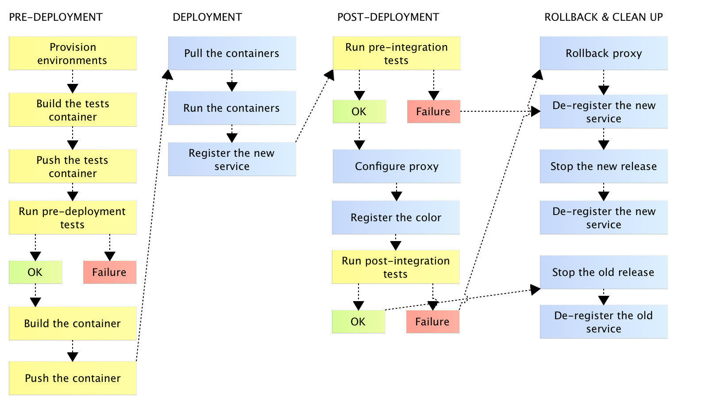

### [对 Jenkins Pipeline 的需求](https://www.cloudbees.com/blog/need-jenkins-pipeline)

复杂的 CD 流程，其中黄色的任务运行在测试服务器，蓝色的运行在生产集群

### 国内外众筹平台
[摩点](https://www.modian.com/) & [Kickstarter](https://www.kickstarter.com/)

### [我的自由软件摄影工作流程](https://blog.fidelramos.net/photography/photography-workflow)

提到的一些软件
- 同步 [Syncthing](https://syncthing.net/)
- 备份 [Restic](https://github.com/restic/restic)

## [仅提示用例的 man 命令替代工具 cheat](https://cloud.tencent.com/developer/article/1682831)
- 安装后用法 `cheat man`
- 网络便携用法 `curl cheat.sh/man`

### shell 脚本模板
- [Ruby on Rails application](https://github.com/github/scripts-to-rule-them-all)
- [githook-clang-format](https://github.com/andrewseidl/githook-clang-format) 作者建议使用编辑器集成的 format 工具

### [我是怎么一步步用 go 找出压测性能瓶颈](https://cloud.tencent.com/developer/article/1160803)
工具 golang pprof, go-torch

### [快速学习Bash](https://www.cnblogs.com/vamei/p/8151169.html)
一份 Bash 教程，之前总是找 shell 教程，原来应该找的是 Bash 😓

### [树莓派与Linux](https://www.cnblogs.com/vamei/archive/2012/10/10/2718229.html)
树莓派教程

### [CMake使用教程和原理](https://cloud.tencent.com/developer/article/1561162)
作者好像很厉害的样子